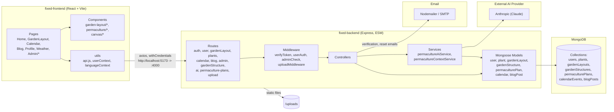
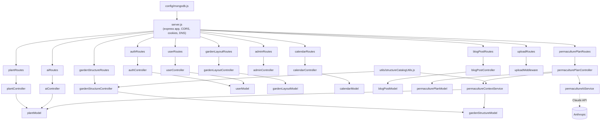
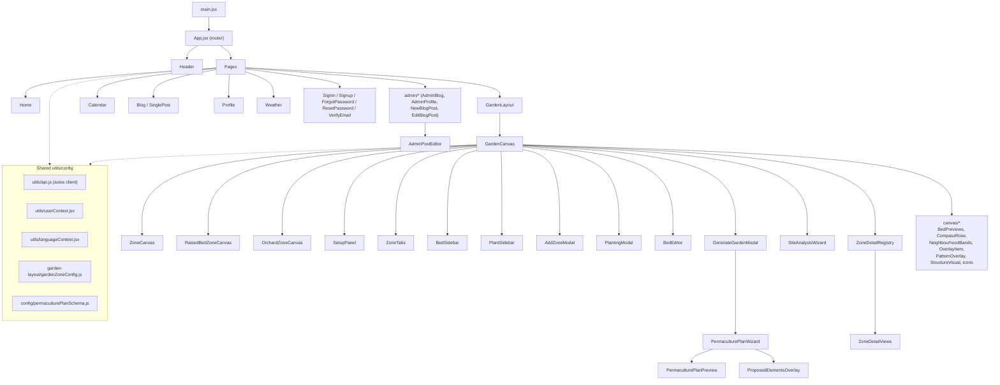

# Backyard Garden — Architecture Overview

## High-level system

## Backend module map

## Frontend module map

## Notes

- **Auth**: cookie-based JWT (`cookie-parser`, `jsonwebtoken`, `verifyToken`/`userAuth`/`adminCheck` middleware), email verification & password reset via Nodemailer.
- **AI integration**: `permacultureAiService` calls the Anthropic (Claude) API, used by `permaculturePlanController` to generate permaculture plans; `permacultureContextService` builds the context (plants + structures) sent to the LLM.
- **Garden Layout editor**: Konva/`react-konva`-based canvas (`GardenCanvas` + `ZoneCanvas` variants + `canvas/*` visual helpers) for laying out beds, structures, and zones, driven by `gardenZoneConfig.js`.
- **File uploads**: `multer` + `/uploads` static route for images (e.g., blog posts, plant/structure icons).
- **Rich text**: Tiptap/ProseMirror used for blog post editing (`AdminPostEditor`).
